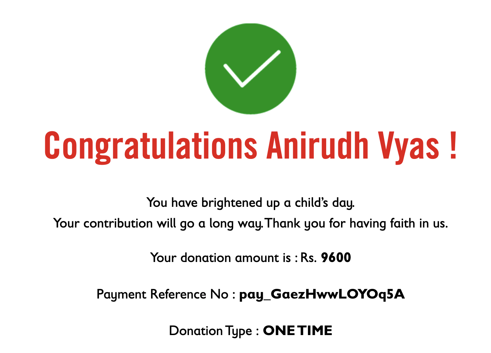

The past 3 months have been a roller coaster! I have a major life update! I resigned from my job at Gojek and will start working at an exciting new startup! In college, I would never have thought I would last at a job for more than 2 years. But it has been a blast working and learning here for the past 3 years and now I think its time, I'll share my experiences and the things I've learnt in a different post. 
I interviewed for several companies, and got multiple offers (which has kept me occupied for the past couple of months), should I write a post on how to prepare for interviews??

But again, these are just excuses and the fact is that I missed posting an update for 2 months straight, so here is my donation.

### Retrospective
1. **Health**
   1. **Workout** - I've been pretty consistent with working out, save for 1 a couple in January, I've been working out regularly
   2. **Meditation** - I failed miserably here, did not do it even on 1 day :scream: 
   3. **Self Authoring Programme** - I made significant progress on the future authoring part, its nearly 40% done, though the progress is much slower than expected.
   
2. **Projects**
   1. I did work on the frontend, and built a basic UI to show the song spotify code, but haven't connected this to the backend, so it shows only a hardcoded song for now. Check it out [here](https://vyas.xyz/spotify-song-viewer/)
3. **Writing**
   1. I did not write even 1 blog post in the past 2 months.
4. **Knowledge**
   1. SICP: I read the 1st chapter, but haven't solved the problems.
   2. The rythm of war: completed the book, I highly recommend it!

**What went well?**
   1. I finally made the decision, resigned from Gojek and starting a new chapter of life!
   2. Getting really amazing offers from multiple companies was really a boost to my confidence and helped with the impostor syndrome

**What can be improved?**
   1. Need to keep these goals more of a focus, I ignored them completely. Maybe defining a why will also help here.

------
### Goals for Next Month
1. **Health**
   1. Workout 5 days a week
   2. Meditate 7 days a week 
   3. Complete the Future authoring Part of Self authoring

2. **Projects**
   1. Complete the frontend for my spotify project - connect it the backend, so that I randomly shows a song or the currently playing song.
   2. Ship the MVP of whatsapp-signal-bot, a tool to nudge you to move away from whatsapp to signal.
   
3. **Writing**
   1. Write a blogpost a week, I'll donate 1000 bucks if I fail this time!

4. **Knowledge**
   1. Complete the problems of ch1 of SICP and read 50 pages along with problems 
   2. Complete the book `Distributed Systems for fun and profit`
   
   
       

