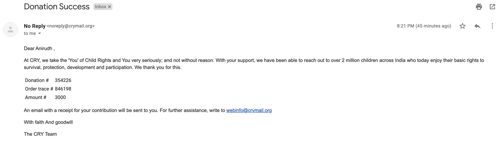

Time for the November Update!

### Retrospective
1. Health
   1. **Workout** - I was consistent with my workouts but instead of 5 days a week, it came down to 3-4 days a week. So I failed in this.
   2. **Meditation** - I down right stopped meditation, only did it for a couple of days
   
2. **Projects**
   1. I did not work on this but instead I worked on a project related to spotify. I've written the [backend](https://github.com/theanirudhvyas/spotify-song-viewer), in the coming month I'll work on the frontend and put it up on the website.
3. **Writing**
   1. I published 2 blog posts in the past month instead of 4, so this was a **failure**.
4. **Knowledge**
   1. Mastering Distributed tracing: I started this book, found it really boring, and stopped it around ch 3.
   2. The Happy Body: I read a decent amount of the book, it is really insightful, though not meant to be read end to end, so I'll continue with this as a reference book.
   3. The rythm of war: Finally the 4th book of the amazing [Stormlight Archives](https://www.goodreads.com/series/49075-the-stormlight-archive) series was released. I've been spending a lot of time reading that over the past 2 weeks. So far it delivers on to my expectation and I've been thoroughly enjoying it!
   
   
As promised, here's my donation to CRY of Rs. 3000

What went well?
- I did not complete my goal of 4 blog posts, but I wrote 2, a 200% increase :p
- I gained back my consistency of working out, after the break

What can be improved?
- I did not do the other things, like reading and writing blogs consistently i.e. I sat on 1 day and did them at once.

### Goals for Next Month
1. **Health**
   1. Workout 4 days a week
   2. Meditate 5 days a week 
   3. Complete the [self authoring programme](https://www.selfauthoring.com/)

2. **Projects**
   1. Complete the frontend for my spotify project. This will be a challenge as I have next to no frontend knowledge.
   
3. **Writing**
   1. I'll continue to strive towards writing 1 blog post a week. (exclusive of these updates)

4. **Knowledge**
   1. I'll read 1 chapter of (SICP)[https://mitpress.mit.edu/sites/default/files/sicp/index.html] along with the problems. I've wanted to read this for some time, no better time to start.
   2. I'll continue reading fiction (Rythm of war)

   
       

